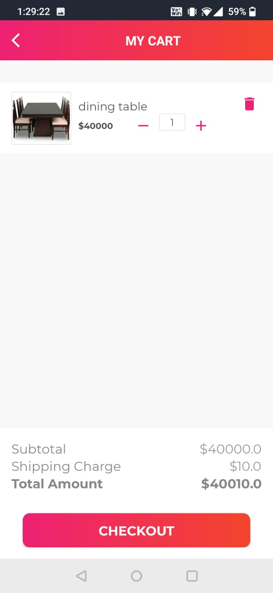

# Apni-Dukan

Another android application. I named it as "Apni Dukaan". It is an ecommerce shop application. In this I have added login and signin activity. I have used bottom navigation for my fragments. There are 4 fragments : Dashboard fragment, products fragment, orders fragment, sold products fragment. Also made cart activity, and settings activity to show the cart items and change the details of user respectively. All of the data is stored in firestore. also the authentication is given while login if a person forgets password using firebase's authentication feature. In the checkout activity i have also integrated payment gateway using razorpay for online payment.

Concepts Implemented:- 
1. Bottom Navigation Bar
2. Activity and Fragment lifecycle
3. Splash screen
4. Firebase : authentication, firestore, Realtime database
5. Designing of views
6. Razorpay integration

Here are the glimpses of the UI of the app:-

<h4>Login activity</h4>

  

<h4>Dashboard Fragment</h4>

  

<h4>cart activity</h4>

  

<h4>sold products detail activity</h4>

  

<h4>Razorpay Integration</h4>

  
